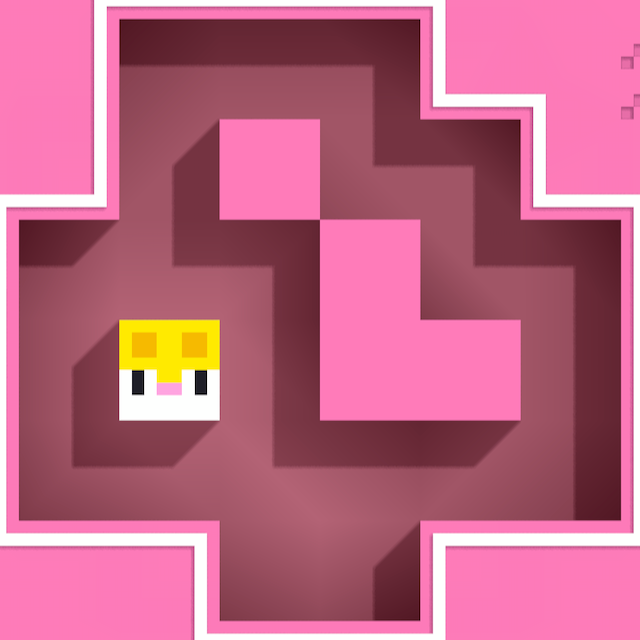

# LongerCat

This program solves the puzzle game Longcat from [Fancade](https://fancade.com/). The game consist of a cat that can be
moved in one direction until it collides with either its trail or a wall. The goal is to fully fill the space without
the cat getting stuck. The solver always finds the solution with the least amount of moves. If the program reports that
no solution is found, it means that is has tried all possible moves and couldn't find a solution.

## Running

The program is written in Java and runs on Java 16 (or Java 15 with preview features enabled). Compile all sources
using `javac -d build src/*`, enter the directory with `cd build` and run with `java Parser`.

## Usage

Enter the puzzle, row by row, using these characters:

- X for walls
- O or space for empty position
- S for start, where the cat initially is

### Example


This puzzle can be entered as

```
xoooxx
xoxoox
oooxoo
osoxxo
oooooo
xxooxx
```

...and you end your input with "end". Then, the program finds a solution and prints out the moves like:

```
DOWN, LEFT, UP, RIGHT, DOWN, RIGHT, ...
```

Just follow the moves to victory.

## Licenses

The code is released under an MIT license. The screenshot is from a minigame in the [Fancade](https://fancade.com) app
developed by Martin Magni, and the minigame [Longcat](https://fancade.page.link/hEt6) is made by him as well.
